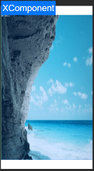

# SDL2

## 简介
>  SDL2(Simple DirectMedia Layer2)是一个应用于多媒体应用程序和游戏开发的跨平台开发库。

## 演示


### SDL2

​	SDL2:基于github的SDL2版本(realse-2.0.12)：[SDL2源码链接](https://github.com/libsdl-org/SDL/tree/release-2.0.12)

### IDE编译运行

​	1、git clone -b master https://gitee.com/openharmony-sig/ohos_sdl2.git ；

​	2、Devecostudio打开ohos-project日录，进行Migrate配置；

​	3、(可选)配置Devecostudio的SDK路径(DevecoStudio5.0.3.652自带SDK)如果需要单独配置，进入setting页面进行配置；

​	4、加签名：file->Project Structure 选择 sign in 加签名；

​	5、编译运行，生成sd12的库。

## 使用说明
```ts
   import sdl from 'libSDL2.so'
```
### 在UI中配置XComponent控件
```ts
	Stack({ alignContent: Alignment.TopStart }) {
	  XComponent({
		id: 'RootXC',
		type: XComponentType.NODE,
		libraryname: 'SDL2'
	  })
		.onAppear(() => {
		  let scaledDensity = display.getDefaultDisplaySync().scaledDensity;
		  display.on('change', (id: number) => {
			const densityDPI = display.getDefaultDisplaySync().densityDPI.toString()
			const scaledDensity = display.getDefaultDisplaySync().scaledDensity.toString()
			const densityPixels = display.getDefaultDisplaySync().densityPixels.toString()
			const xDPI = display.getDefaultDisplaySync().xDPI.toString()
			const yDPI = display.getDefaultDisplaySync().yDPI.toString()
			const widthStr = display.getDefaultDisplaySync().width.toString()
			const heightStr = display.getDefaultDisplaySync().height.toString()
			console.log('densityDPI(显示设备屏幕的物理像素密度，表示每英寸上的像素点数):' + densityDPI
			  + '\nscaledDensity(显示设备的显示字体的缩放因子):' + scaledDensity
			  + '\ndensityPixels(显示设备逻辑像素的密度，代表物理像素与逻辑像素的缩放系数):' + densityPixels
			  + '\nxDPI(x方向中每英寸屏幕的确切物理像素值):' + xDPI
			  + '\nyDPI(y方向中每英寸屏幕的确切物理像素值):' + yDPI
			  + '\nwidth:' + widthStr
			  + '\nheight:' + heightStr)

		  })
		  sdl.setScaledDensity(scaledDensity)
		  sdl.createNativeNode('RootXC', this.mWidth, this.mHeight, this.x, this.y)
		  console.log("test createNativeNode")
		  notifySdlAboutToAppear(getContext(this))
		})
		.width('100%')
		.height('100%')
		.id('RootXComponent')
		.backgroundColor(Color.Yellow)
	}
```

### 创建嵌套窗口
```c++
    // 加载图片文件
    original = SDL_ConvertSurfaceFormat(SDL_LoadBMP("testyuv.bmp"), SDL_PIXELFORMAT_RGB24, 0);
    // 创建嵌套窗口
    window = SDL_CreateWindowFrom((void *)WinId());
    // 创建渲染器
    renderer = SDL_CreateRenderer(window, -1, 0);
    // 创建纹理
    output = SDL_CreateTextureFromSurface(renderer, original);
    // 纹理复制给渲染器
    SDL_RenderClear(renderer);
    SDL_RenderCopy(renderer, output, NULL, NULL);
    SDL_SetRenderDrawColor(renderer, 0xFF, 0xFF, 0xFF, 0xFF);
    // 显示纹理
	SDL_RenderPresent(renderer);
	// 释放资源
	SDL_DestroyTexture(output);
    SDL_DestroyRenderer(renderer);
    SDL_DestroyWindow(window);
```
### 播放音频文件
```c++
	// 加载音频文件
	SDL_LoadWAV("dynamic2.wav", &wave.spec, &wave.sound, &wave.soundlen);
	// 设置音频播放回调
	wave.spec.callback = fillerup;
	// 打开音频设备
	device = SDL_OpenAudioDevice(NULL, SDL_FALSE, &wave.spec, NULL, 0);
	// 开始播放
	SDL_PauseAudio(SDL_FALSE);
	// 关闭播放设备
	SDL_CloseAudioDevice(device_id);
```

## 接口说明

​	为满足特定用户诉求，当前只对SDL2库中部分接口进行了适配；如需使用未适配接口，请联系。当前已经适配接口共计74个，涵盖基础能力、窗口、音视频、渲染等模块的特定接口，详情如下：

### SDL2开源库基础能力移植适配

| 接口名             | SDL Wiki                                        |
| ------------------ | ----------------------------------------------- |
| SDL_memset         | https://wiki.libsdl.org/SDL2/SDL_memset         |
| SDL_GL_LoadLibrary | https://wiki.libsdl.org/SDL2/SDL_GL_LoadLibrary |
| SDL_Delay          | https://wiki.libsdl.org/SDL2/SDL_Delay          |
| SDL_getenv         | https://wiki.libsdl.org/SDL2/SDL_getenv         |
| SDL_Init           | https://wiki.libsdl.org/SDL2/SDL_Init           |
| SDL_WasInit        | https://wiki.libsdl.org/SDL2/SDL_WasInit        |
| SDL_InitSubSystem  | https://wiki.libsdl.org/SDL2/SDL_InitSubSystem  |
| SDL_RectEmpty      | https://wiki.libsdl.org/SDL2/SDL_RectEmpty      |
| SDL_LogSetPrior    | https://wiki.libsdl.org/SDL2/SDL_LogSetPriority |
| SDL_SetHint        | https://wiki.libsdl.org/SDL2/SDL_SetHint        |
| SDL_Quit           | https://wiki.libsdl.org/SDL2/SDL_Quit           |
| SDL_GetError       | https://wiki.libsdl.org/SDL2/SDL_GetError       |


### SDL2开源库多线程并发，定时器异步功能移植适配
| 接口名               | SDL Wiki                                          |
| -------------------- | ------------------------------------------------- |
| SDL_CreateThread     | https://wiki.libsdl.org/SDL2/SDL_CreateThread     |
| SDL_WaitThread       | https://wiki.libsdl.org/SDL2/SDL_WaitThread       |
| SDL_CreateMutex      | https://wiki.libsdl.org/SDL2/SDL_CreateMutex      |
| SDL_LockMutex        | https://wiki.libsdl.org/SDL2/SDL_LockMutex        |
| SDL_UnlockMutex      | https://wiki.libsdl.org/SDL2/SDL_UnlockMutex      |
| SDL_DestroyMutex     | https://wiki.libsdl.org/SDL2/SDL_DestroyMutex     |
| SDL_CreateCond       | https://wiki.libsdl.org/SDL2/SDL_CreateCond       |
| SDL_CondSignal       | https://wiki.libsdl.org/SDL2/SDL_CondSignal       |
| SDL_CondBroadcast    | https://wiki.libsdl.org/SDL2/SDL_CondBroadcast    |
| SDL_CondWait         | https://wiki.libsdl.org/SDL2/SDL_CondWait         |
| SDL_CondWaitTimeout  | https://wiki.libsdl.org/SDL2/SDL_CondWaitTimeout  |
| SDL_DestroyCond      | https://wiki.libsdl.org/SDL2/SDL_DestroyCond      |
| SDL_CreateSemaphore  | https://wiki.libsdl.org/SDL2/SDL_CreateSemaphore  |
| SDL_SemPost          | https://wiki.libsdl.org/SDL2/SDL_SemPost          |
| SDL_SemWait          | https://wiki.libsdl.org/SDL2/SDL_SemWait          |
| SDL_DestroySemaphore | https://wiki.libsdl.org/SDL2/SDL_DestroySemaphore |
| SDL_AddTimer         | https://wiki.libsdl.org/SDL2/SDL_AddTimer         |
| SDL_RemoveTimer      | https://wiki.libsdl.org/SDL2/SDL_RemoveTimer      |

### SDL2开源库事件功能移植适配

| 接口名   | SDL Wiki       |
|-----------|--------------------|
| SDL_PushEvent | https://wiki.libsdl.org/SDL2/SDL_PushEvent |
| SDL_FlushEvents | https://wiki.libsdl.org/SDL2/SDL_FlushEvents |
| SDL_EventState | https://wiki.libsdl.org/SDL2/SDL_EventState |

### SDL2开源库音频功能移植适配

| 接口名                   | SDL Wiki                                              |
| ------------------------ | ----------------------------------------------------- |
| SDL_OpenAudioDevice      | https://wiki.libsdl.org/SDL2/SDL_OpenAudioDevice      |
| SDL_MixAudio             | https://wiki.libsdl.org/SDL2/SDL_MixAudio             |
| SDL_PauseAudioDevice     | https://wiki.libsdl.org/SDL2/SDL_PauseAudioDevice     |
| SDL_CloseAudioDevice     | https://wiki.libsdl.org/SDL2/SDL_CloseAudioDevice     |
| SDL_GetNumAudioDevices   | https://wiki.libsdl.org/SDL2/SDL_GetNumAudioDevices   |
| SDL_GetAudioDeviceName   | https://wiki.libsdl.org/SDL2/SDL_GetAudioDeviceName   |
| SDL_GetAudioDeviceStatus | https://wiki.libsdl.org/SDL2/SDL_GetAudioDeviceStatus |
| SDL_LockAudioDevice      | https://wiki.libsdl.org/SDL2/SDL_LockAudioDevice      |
| SDL_UnlockAudioDevice    | https://wiki.libsdl.org/SDL2/SDL_UnlockAudioDevice    |

### SDL2开源库窗口功能移植适配

| 接口名                | SDL Wiki                                           |
| --------------------- | -------------------------------------------------- |
| SDL_CreateWindow      | https://wiki.libsdl.org/SDL2/SDL_CreateWindow      |
| SDL_DestroyWindow     | https://wiki.libsdl.org/SDL2/SDL_DestroyWindow     |
| SDL_CreateWindowFrom  | https://wiki.libsdl.org/SDL2/SDL_CreateWindowFrom  |
| SDL_SetWindowPosition | https://wiki.libsdl.org/SDL2/SDL_SetWindowPosition |
| SDL_GetWindowPosition | https://wiki.libsdl.org/SDL2/SDL_GetWindowPosition |
| SDL_SetWindowSize     | https://wiki.libsdl.org/SDL2/SDL_SetWindowSize     |
| SDL_GetWindowSize     | https://wiki.libsdl.org/SDL2/SDL_GetWindowSize     |
| SDL_ShowWindow        | https://wiki.libsdl.org/SDL2/SDL_ShowWindow        |
| SDL_GetWindowFlags    | https://wiki.libsdl.org/SDL2/SDL_GetWindowFlags    |
| SDL_GetWindowID       | https://wiki.libsdl.org/SDL2/SDL_GetWindowID       |
| SDL_HideWindow        | https://wiki.libsdl.org/SDL2/SDL_HideWindow        |

### SDL2开源库光标管理功能移植适配

| 接口名                 | SDL Wiki                                            |
| ---------------------- | --------------------------------------------------- |
| SDL_CreateSystemCursor | https://wiki.libsdl.org/SDL2/SDL_CreateSystemCursor |
| SDL_SetCursor          | https://wiki.libsdl.org/SDL2/SDL_SetCursor          |
| SDL_ShowCursor         | https://wiki.libsdl.org/SDL2/SDL_ShowCursor         |

### SDL2开源库纹理管理功能移植适配

| 接口名                  | SDL Wiki                                             |
| ----------------------- | ---------------------------------------------------- |
| SDL_CreateTexture       | https://wiki.libsdl.org/SDL2/SDL_CreateTexture       |
| SDL_LockTexture         | https://wiki.libsdl.org/SDL2/SDL_LockTexture         |
| SDL_UnlockTexture       | https://wiki.libsdl.org/SDL2/SDL_UnlockTexture       |
| SDL_SetTextureBlendMode | https://wiki.libsdl.org/SDL2/SDL_SetTextureBlendMode |
| SDL_UpdateYUVTexture    | https://wiki.libsdl.org/SDL2/SDL_UpdateYUVTexture    |
| SDL_DestroyTexture      | https://wiki.libsdl.org/SDL2/SDL_DestroyTexture      |

### SDL2开源库渲染功能移植适配

| 接口名                 | SDL Wiki                                            |
| ---------------------- | --------------------------------------------------- |
| SDL_RenderReadPixels   | https://wiki.libsdl.org/SDL2/SDL_RenderReadPixels   |
| SDL_RenderSetClipRect  | https://wiki.libsdl.org/SDL2/SDL_RenderSetClipRect  |
| SDL_RenderClear        | https://wiki.libsdl.org/SDL2/SDL_RenderClear        |
| SDL_RenderPresent      | https://wiki.libsdl.org/SDL2/SDL_RenderPresent      |
| SDL_RenderFlush        | https://wiki.libsdl.org/SDL2/SDL_RenderFlush        |
| SDL_RenderGetViewport  | https://wiki.libsdl.org/SDL2/SDL_RenderGetViewport  |
| SDL_SetRenderDrawColor | https://wiki.libsdl.org/SDL2/SDL_SetRenderDrawColor |
| SDL_RenderCopy         | https://wiki.libsdl.org/SDL2/SDL_RenderCopy         |
| SDL_CreateRenderer     | https://wiki.libsdl.org/SDL2/SDL_CreateRenderer     |
| SDL_SetRenderTarget    | https://wiki.libsdl.org/SDL2/SDL_SetRenderTarget    |
| SDL_DestroyRenderer    | https://wiki.libsdl.org/SDL2/SDL_DestroyRenderer    |
| SDL_RenderCopyEx       | https://wiki.libsdl.org/SDL2/SDL_RenderCopyEx       |

## 约束与限制

在下述版本验证通过：
- DevEco Studio 5.0.0 Release --SDK:API12

## 目录结构

```sdl
.
|	└── ohos-project
|		├── build-profile.json5
|		├── entry
|		│   └── src
|		│       └── main
|		│           ├── cpp
|		│           │   ├── ohos_sdl2                            sdl2适配源码
|		│           │   │   ├── CMakeLists.txt
|		│           │   │   ├── ohos-project
|		│           │   │   │   │   └── src
|		│           │   │   │   │       └── main
|		│           │   │   │   │           ├── cpp
|		│           │   │   │   │           │   ├── CMakeLists.txt
|		│           │   │   │   │           │   ├── application              执行测试用例目录
|		│           │   │   │   │           ├── ets
|		│           │   │   │   │           │   ├── pages
|		│           │   │   │   │           │   │   └── Index.ets
|		│           │   │   │   │   audio       │   └── service                ets界面功能
|		│           │   │   │   │   ├── ohos                                  音频适配
|		│           │   │   │   ├── core
|		│           │   │   │   │   ├
|		│           │   │   │   │   ├── ohos                           xcompoent管理
|		│           │   │   │   │   │   └── adapter_c
|		│           │   │   │   │   │       ├── AdapterC.cpp
|		│           │   │   │   │   │       └── AdapterC.h
|									video	
|							        ├── ohos                                视频功能适配
|					   
```

## 贡献代码

使用过程中发现任何问题都可以提[Issue](https://gitee.com/openharmony-sig/ohos_sdl2/issues) 给组件，当然，也非常欢迎发[PR](https://gitee.com/openharmony-sig/ohos_sdl2/pulls)共建。

## 开源协议

本项目基于 [Zlib License](LICENSE)，请自由地享受和参与开源。


